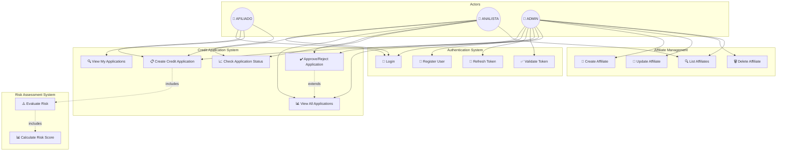
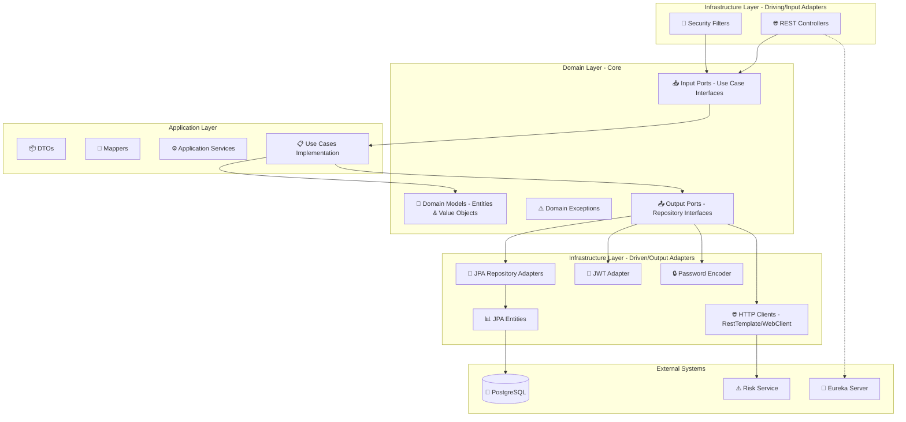
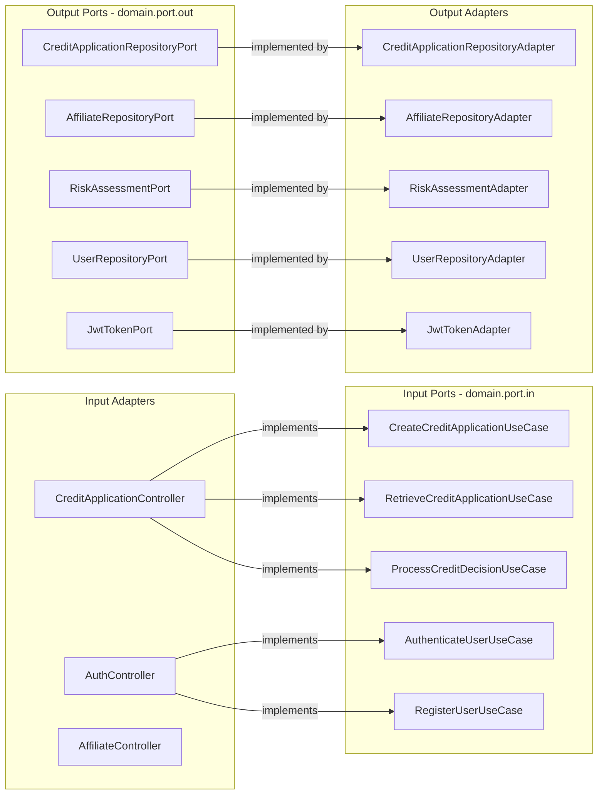
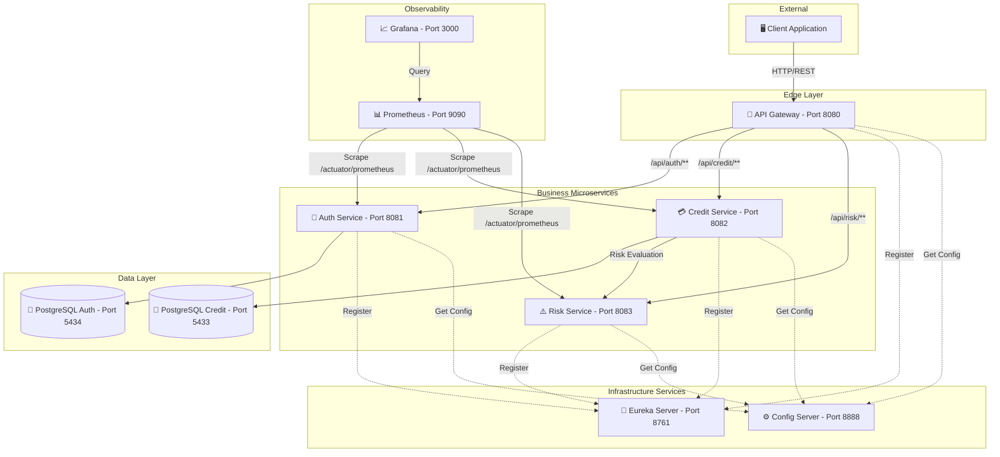
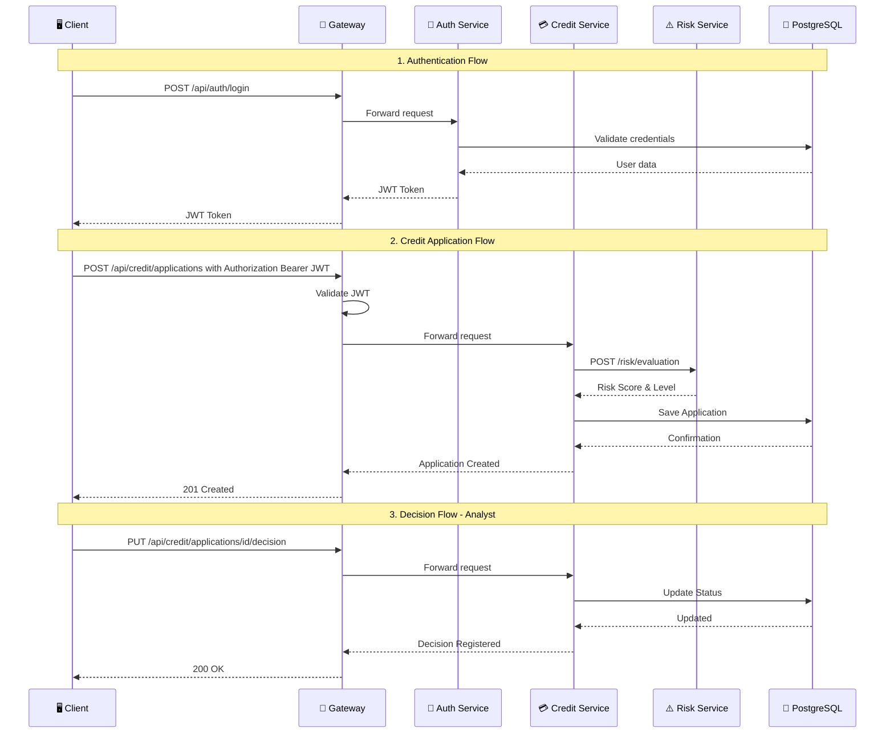

# 🏦 CoopCredit Microservices System

Distributed cooperative credit management system based on microservices architecture, designed to be scalable, resilient, and observable.

---

## 📋 System Description

CoopCredit is a platform that enables comprehensive management of the credit lifecycle for a cooperative. The system handles everything from the creation of applications by affiliates or analysts, through automatic risk assessment, to final approval or rejection.

### Key Features
- **Hexagonal Architecture**: Domain core isolated from frameworks and external dependencies.
- **Security**: Robust authentication and authorization using JWT.
- **Risk Assessment**: Integration with a rule engine for credit scoring.
- **Full Observability**: Metrics (Prometheus/Grafana), Health Checks (Actuator), and Traceability.

---

## � Use Case Diagram



---

## �🏗️ Hexagonal Architecture

The system follows a **Hexagonal Architecture (Ports and Adapters)** to ensure domain independence and clean separation of concerns.

### Architecture Overview



### Layer Details

| Layer | Package | Responsibility |
|-------|---------|----------------|
| **Domain** | `domain.models`, `domain.port.in`, `domain.port.out`, `domain.exception` | Business logic, entities, use case interfaces (ports) |
| **Application** | `application.usecases`, `application.dto`, `application.mapper`, `application.services` | Use case implementation, DTO transformation |
| **Infrastructure** | `infrastructure.controller`, `infrastructure.adapters`, `infrastructure.entities`, `infrastructure.security` | REST endpoints, JPA implementation, external integrations |

### Ports and Adapters Detail



---

## 🔗 Microservices Diagram

### System Architecture



### Service Communication Flow



### Ecosystem Services

| Service | Port | Technology | Description |
|----------|--------|------------|-------------|
| **Gateway** | `8080` | Spring Cloud Gateway | Single entry point, routing, and perimeter security. |
| **Auth Service** | `8081` | Spring Security + JWT | User management and token issuance. |
| **Credit Service** | `8082` | Spring Boot | Credit application lifecycle management. |
| **Risk Service** | `8083` | Spring Boot | Risk assessment and scoring engine. |
| **Eureka** | `8761` | Netflix Eureka | Service discovery. |
| **Config Server** | `8888` | Spring Cloud Config | Centralized configuration management. |
| **Prometheus** | `9090` | Prometheus | Metrics collection and storage. |
| **Grafana** | `3000` | Grafana | Metrics visualization and dashboards. |

---

## 📁 Project Structure (Hexagonal Architecture)

```
microservice-credit-application-service/
└── src/main/java/com/riwi/microservice/coopcredit/credit/
    ├── 📂 domain/                          # 🎯 DOMAIN LAYER (Core)
    │   ├── 📂 models/                      # Domain Entities
    │   │   ├── Affiliate.java
    │   │   ├── CreditApplication.java
    │   │   ├── RiskEvaluation.java
    │   │   └── 📂 enums/
    │   ├── 📂 port/
    │   │   ├── 📂 in/                      # Input Ports (Use Cases)
    │   │   │   ├── CreateCreditApplicationUseCase.java
    │   │   │   ├── RetrieveCreditApplicationUseCase.java
    │   │   │   └── ProcessCreditDecisionUseCase.java
    │   │   └── 📂 out/                     # Output Ports (Repositories)
    │   │       ├── CreditApplicationRepositoryPort.java
    │   │       ├── AffiliateRepositoryPort.java
    │   │       └── RiskAssessmentPort.java
    │   └── 📂 exception/                   # Domain Exceptions
    │
    ├── 📂 application/                     # ⚙️ APPLICATION LAYER
    │   ├── 📂 usecases/                    # Use Case Implementations
    │   │   ├── CreateCreditApplicationUseCaseImpl.java
    │   │   ├── RetrieveCreditApplicationUseCaseImpl.java
    │   │   └── ProcessCreditDecisionUseCaseImpl.java
    │   ├── 📂 dto/                         # Data Transfer Objects
    │   ├── 📂 mapper/                      # DTO <-> Domain Mappers
    │   └── 📂 services/                    # Application Services
    │
    └── 📂 infrastructure/                  # 🔌 INFRASTRUCTURE LAYER
        ├── 📂 controller/                  # REST Controllers (Input Adapters)
        ├── 📂 adapters/                    # Output Adapters
        │   ├── CreditApplicationRepositoryAdapter.java
        │   ├── AffiliateRepositoryAdapter.java
        │   └── RiskAssessmentAdapter.java
        ├── 📂 entities/                    # JPA Entities
        ├── 📂 repositories/                # JPA Repositories
        ├── 📂 mapper/                      # Entity <-> Domain Mappers
        ├── 📂 security/                    # Security Configuration
        ├── 📂 config/                      # Infrastructure Config
        └── 📂 exception/                   # Global Exception Handlers
```

---

## 👥 Roles and Business Flow

### System Roles
The system implements Role-Based Access Control (RBAC) extracted from the JWT token:

1.  **ROLE_AFILIADO**: Can create credit applications for themselves and check their status.
2.  **ROLE_ANALISTA**: Can create applications, query any application, and register decisions (approve/reject).
3.  **ROLE_ADMIN**: Full access to the system for management and configuration.

### Credit Application Flow
1.  **Authentication**: User obtains a JWT token via `/api/auth/login`.
2.  **Application**: Sends a `POST` request to the credit service with amount, term, and purpose.
3.  **Automatic Assessment**: The credit service synchronously queries the **Risk Service**.
    *   Score, debt capacity, and risk level are calculated.
4.  **Persistence**: The application is saved with status `PENDIENTE` (Pending) or `EN_REVISION` (Under Review).
5.  **Decision**: An analyst reviews the application and registers approval or rejection.

---

## 🔌 Main Endpoints

### 🔐 Auth Service (`/api/auth`)
- `POST /login`: Login and obtain Token.
- `POST /register`: Register new user.

### 💳 Credit Service (`/api/credit`)
- `POST /applications`: Create new application.
- `GET /applications/{id}`: Get application details.
- `PUT /applications/{id}/decision`: (Analyst) Approve or reject application.

### ⚠️ Risk Service (`/api/risk`)
- `POST /evaluation`: Evaluate risk of a financial profile.

---

## 🚀 Project Execution

### Prerequisites
- Docker and Docker Compose
- Java 17 (for local development)
- Maven 3.8+

### 🐳 Execution with Docker Compose (Recommended)

Starts the entire ecosystem (Databases, Services, Observability):

```bash
docker-compose up -d --build
```

**Access Tools:**
- **Grafana**: [http://localhost:3000](http://localhost:3000) (User: `admin`, Pass: `admin`)
- **Prometheus**: [http://localhost:9090](http://localhost:9090)
- **Eureka Dashboard**: [http://localhost:8761](http://localhost:8761)

### 💻 Local Execution (Development)

1.  **Compile the entire project:**
    ```bash
    mvn clean install -DskipTests
    ```
2.  **Start base infrastructure (DBs, Eureka, Config):**
    ```bash
    docker-compose up -d postgres-auth postgres-credit microservice-eureka microservice-config
    ```
3.  **Run microservice (e.g., Credit Service):**
    ```bash
    cd microservice-credit-application-service
    mvn spring-boot:run
    ```

---

## 📊 Observability and Monitoring

The system implements a full observability stack:

### Metrics (Actuator + Prometheus)
Each microservice exposes metrics at `/actuator/prometheus`.
- **Key Metrics**:
    - `http_server_requests_seconds`: Latency and throughput per endpoint.
    - `security_authentication_failures_total`: Failed login attempts.
    - `jdbc_connections_active`: Connection pool usage.

### Logs
Structured logging in console, collectible by tools like ELK or Loki (not included in this basic compose).

---

## 🧪 Testing and Quality

### Running Tests
The project includes unit and integration tests using **Testcontainers**.

```bash
mvn test
```

### Test Evidence
*(Placeholder for JUnit/Surefire report screenshots)*
> 

### Metrics Evidence (Grafana)
*(Placeholder for Grafana dashboard screenshot)*
> 

---

## 🛠️ Technologies Used

- **Language**: Java 17
- **Framework**: Spring Boot 3.x
- **Cloud**: Spring Cloud (Gateway, Config, Eureka)
- **Database**: PostgreSQL
- **Migrations**: Flyway
- **Mapping**: MapStruct
- **Testing**: JUnit 5, Mockito, Testcontainers
- **Containers**: Docker
